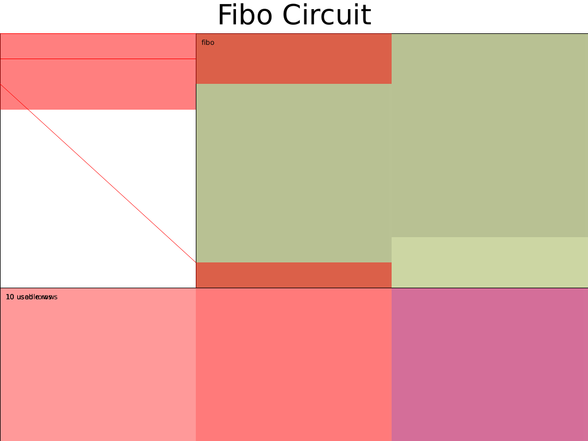
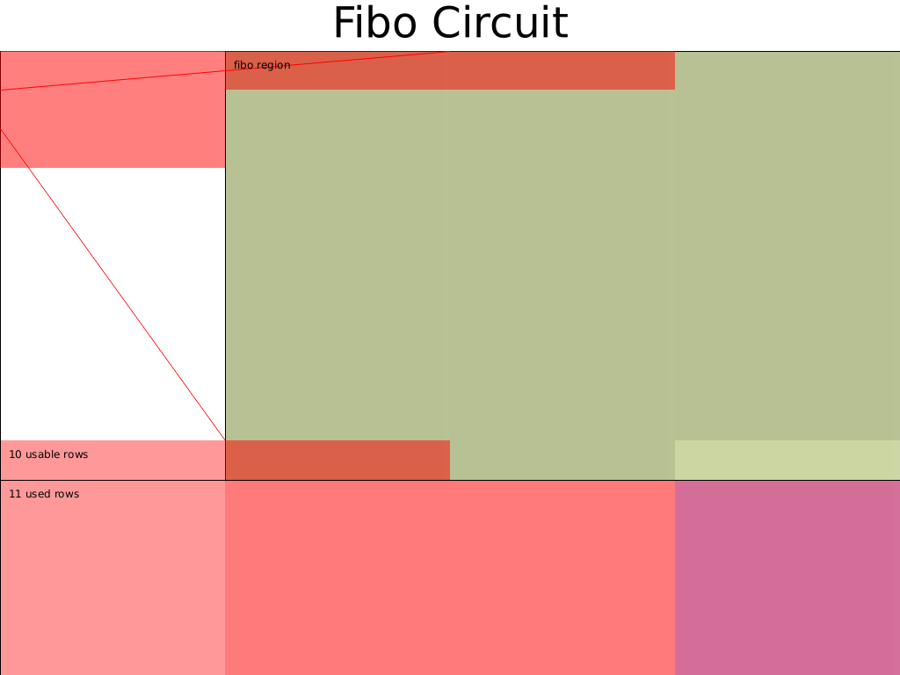

> - 作者:  [@Po@Ethstorage.io](https://github.com/dajuguan)
> - 时间: 2023-10-24
> - 校对:  [@Demian](https://github.com/demian101)

# 进阶电路布局

之前的教程中的电路行数相对较少，且相邻 region 之间所采用的门也不一样，因此我们一行行地填入 witness 。本节我们则考虑相邻 region 都是采用同一种门的电路-- Fibonacci 数列，并学习采用循环来复用填入 witness 代码；其次，考虑另一种电路布局的 Fibonacci 电路实现，来体会如何优化设计电路布局。

## Fibonacci

### 问题定义

Fibonacci数列是证明如下问题:
```
public inputs: a, b, f(N) #N为已知的电路配置
constraints: 
    f(0) = a
    f(1) = b
    f(n) = f(n-1) + f(n-2), n = 2,...,N
```
我们采用只包含一列 Advice 的电路配置，使用相邻三行单元格组成的加法门，并且只划分为一个大 region , 在 region 内部通过 `offset` 来确定要填入的单元格。Fibonacci 电路的 witness 表格为:

| ins   | a0    | seletor |
|-------|-------|-------|
|   a   | f(0)=a|    1  | 
|   b   | f(1)=b|    1  |  
|  out  | f(2)  |    1  |  
|       | f(3)  |    1  |   
|          ...          |
|       | f(n-2)|   1   | 
|       | f(n-1)|   0   |   
|       |f(n)=out|  0  |   

[完整代码见](https://github.com/zkp-co-learning/halo2-step-by-step/blob/main/halo2-tutorials/src/chap_3/circuit_1.rs)

### Config
如前所述，电路配置只需一列 `Advice` 和 一列 `selector`, 我们将此电路定义为 `FiboChip`。

```
#[derive(Debug, Clone)]
struct FiboChipConfig {
    advice: Column<Advice> ,
    instance: Column<Instance>,
    selector: Selector,
}

#[derive(Debug, Clone)]
struct FiboChip<F:Field>{
    config: FiboChipConfig,
    _marker: PhantomData<F>
}

#[derive(Debug, Clone)]
struct ACell<F:Field> (AssignedCell<F,F>);

impl <F:Field> FiboChip<F> {
    fn construct(config: FiboChipConfig) -> Self {
        FiboChip {
            config,
            _marker: PhantomData,
        }
    }

    fn configure(
        meta: &mut ConstraintSystem<F>,
        advice: Column<Advice> ,
        instance: Column<Instance>,
    ) -> FiboChipConfig {
        let selector = meta.selector();
        meta.enable_equality(advice);
        meta.enable_equality(instance);

        meta.create_gate(
            "fibo gate", 
            |meta| {
                let cur_row = meta.query_advice(advice, Rotation::cur());
                let next_row = meta.query_advice(advice, Rotation::next());
                let third_row = meta.query_advice(advice, Rotation(2)); 
                let s = meta.query_selector(selector);
                vec![s*(cur_row + next_row - third_row)]
            }
        );

        FiboChipConfig {
            advice,
            instance,
            selector
        }
    }
    ...
}
```

### 为`FiboChip` 增加填入 witness 的方法 `assign_witness`
这里我们假设 `FiboChip` 计算的行数 `nrow` 由调用它的电路提供。然后通过 `mut f_pre` 和 `mut f_cur` 结合 for 循环一行行填入witness。

```
impl <F:Field> FiboChip<F> {
    ...
    fn assign_witness(
        &self,
        mut layouter: impl Layouter<F>,
        nrow: usize
    ) -> Result<ACell<F>, Error> {
        layouter.assign_region(
            || "fibo", 
            |mut region| {
                let instance = self.config.instance;
                let advice = self.config.advice;
                let selector =  self.config.selector;
                selector.enable(&mut region, 0)?;
                selector.enable(&mut region, 1)?;
                let mut f_pre = region.assign_advice_from_instance(
                    || "f0",instance , 0, advice, 0).map(ACell)?;
                let mut f_cur = region.assign_advice_from_instance(
                    || "f1", instance, 1, advice, 1).map(ACell)?;
                for i in 2..nrow{
                    if i < nrow -2 {
                        selector.enable(&mut region, i)?;
                    }
                    let value = f_pre.0.value().copied() +  f_cur.0.value();
                    let f_next = region.assign_advice(
                        || "fn", advice, i, || value).map(ACell)?;
                    f_pre = f_cur;
                    f_cur = f_next;

                }
                Ok(f_cur)
            }
        )
    }
}
```
> 注意: 最后两行不需要enable selector了，因为这里使用的门约束的是相邻的三个row，输出值f(N) 已经在第 n-2 个行的门中被约束了。 

### 实现Circuit Trait
最后使用 `FiboChip` 来创建 `FiboCircuit` 电路，并实现 Circuit Trait:

```
#[derive(Debug, Clone,Default)]
struct FiboCircuit<F:Field> {
    nrow: usize,
    _marker: PhantomData<F>
}

impl <F:Field> Circuit<F> for FiboCircuit<F> {
    type Config = FiboChipConfig;
    type FloorPlanner = SimpleFloorPlanner;

    fn without_witnesses(&self) -> Self {
        FiboCircuit::default()
    }

    fn configure(meta: &mut ConstraintSystem<F>) -> Self::Config {
        let advice = meta.advice_column();
        let instance = meta.instance_column();
        FiboChip::configure(meta, advice, instance)
        
    }
    fn synthesize(&self, config: Self::Config, mut layouter: impl Layouter<F>) -> Result<(), Error> {
        let chip = FiboChip::construct(config);
        let out = FiboChip::assign_witness(&chip, layouter.namespace(|| "fibo table"), self.nrow)?;
        //expose public
        layouter.namespace(|| "out").constrain_instance(out.0.cell(), chip.config.instance, 2)
    }
}
```

> 注意: 具有不同 `nrow` 的`FiboCircuit` 实际上对应的是不同的电路。

电路布局图为:



## 另一种 Fibonacci 电路布局
Halo2 中电路的布局主要与怎么设计门有关，需要在如下变量之间权衡:
1. witness 多少列
2. selector 多少列
3. 门的dgree、门的输入输出需包含哪些相邻单元格

上一小节我们采用 1 列 witness 、1 个 selector 和包含相邻三个单元格的加法门，这次我们则选择2列 witness 、1个 selector 和相邻两行四个单元格组成的门，来重新设计Fibonacci电路。电路的witness表格设计如下:

| ins   | a0     |   a1   | seletor|
|-------|------- |------- |------- |
|   a   | f(0)=a | f(1)=b |    1   | 
|   b   | f(2)=b | f(3)   |    1   |  
|  out  | f(4)   | f(5)   |    1   |   
|          ...            |        |
|       | f(2n/2) |f(2n/2+1)|   1  | 
其中n依然为 Fibonacci 计算的 f(n) , 这里需要注意最后一行，我们即使在n为偶数也将这行填满，同时根据 n 是否为奇数来约束out： `out === n % 2 == 0 ? f(2n/2) : f(2n/2 + 1)`。

完整代码见[Halo2 tutorial: chap_3/circuit_2.rs](https://github.com/zkp-co-learning/halo2-step-by-step/blob/main/halo2-tutorials/src/chap_3/circuit_2.rs)

其他的代码与上一小节基本类似，这里只对使用到的 custom gate 进行说明:
```
    meta.create_gate( "fibo gate", |meta|{
        let s = meta.query_selector(selector);
        let cur_left = meta.query_advice(advice[0], Rotation::cur());
        let cur_right = meta.query_advice(advice[1], Rotation::cur());
        let next_left = meta.query_advice(advice[0], Rotation::next());
        let next_right = meta.query_advice(advice[1], Rotation::next());
        Constraints::with_selector(s, 
            vec![
                (cur_left + cur_right.clone() - next_left.clone()), 
                (cur_right + next_left - next_right)]
            )
    });
```

这里我们使用了 `Constraints::with_selector` 的一个更高级用法，使得当 selector enable 时，如下两个约束需同时成立:
1. f(2n-2) + f(2n-1) = f(2n)
2. f(2n-1) + f(2n) = f(2n+1)

电路布局图为:


## 总结
不同的电路布局没有绝对的优劣之分，它们都是在行数、列数、degree 、permuation 包括后面会涉及到的 lookup 等进行权衡，最终这些决定了 prover 计算成本与 proof 大小之间的权衡。
