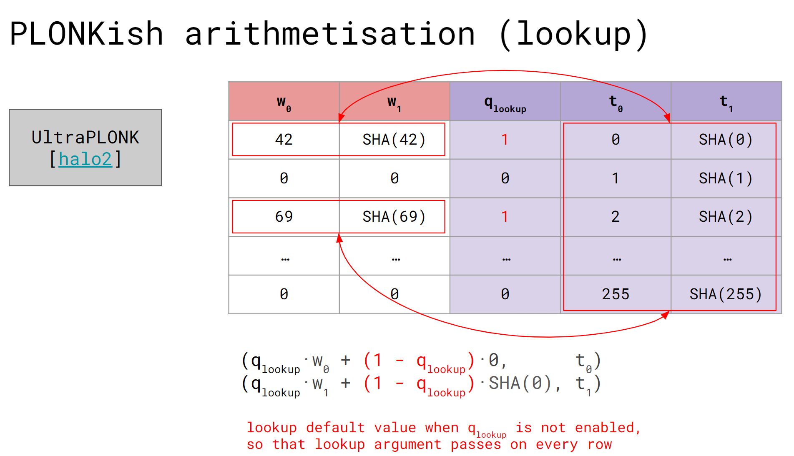

> - 作者:  [@Po@Ethstorage.io](https://github.com/dajuguan)
> - 时间: 2023-10-31
> - 校对:  [@Demian](https://github.com/demian101)

[TOC]

# lookup
前面的章节中我们介绍了 Halo2 的 API 和电路布局等核心概念，这节则介绍 Plonk 证明系统中基于 permutation argment 抽象出的一个强大功能 lookup 。Halo2 中使用的 lookup 对 [plookup](https://eprint.iacr.org/2020/315.pdf) 进行了简化，可以约束**一列或多列**的 cells 的值属于对应的 lookup 列。如下图，我们可以通过 lookup 约束 $w_0,w_1$ 两列中的第 1、3 行属于查找表( $t_0,t_1$列)中的某一行;对于不需要查找的则约束其属于查找表的某个默认行。

关于Zcash版本的lookup,有两个问题需要注意:
1. 多列 lookup 不同列的相同行必须**同时存在**于查找表中，Halo2 底层通过一个随机数讲各列对应行的 row 组合起来使其回归到单列 lookup;
2. 多列 lookup 时，需约束的多列 witness 不一定在同一行，但是查找表中对应的所有列时在同一行。比如上述例子也可以进行如下的lookup:

同时可参考不在对不在同一行的两列进行 lookup的[示例代码: halo2-tutorials/chap_4/circuit_1](https://github.com/zkp-co-learning/halo2-step-by-step/blob/main/halo2-tutorials/src/chap_4/circuit_1.rs)。

## 单列 lookup
首先从最简单的单例 lookup 介绍如何使用 lookup API。我们的目的是证明: 
```
private inputs: a[N]
constant: RANGE
s.t: a[i] ∈ [0, RANGE], ∀ i ∈ [0, N-1]
```
若直接采用 gate 约束的话，我们需要设计形如 $(a[i] - 0) * (a[i]-1) * (a[i]-2)...(a[i]-RANGE) = 0, ∀ i ∈ [0, N-1] $的电路，当 RANGE 很大时(比如2^16) 电路的 degree 会很高, 这会导致整个 proof 很大。因此，我们可以采用 lookup 方式实现(回忆 permutation argument 只会将 degree 增加1)，将 $[0,RANGE]$ 这些值填入 `TableColumn` 中(Zcash版本Halo2只支持静态查找表, 因此只能填入`TableColumn`)，并借助 `lookup` API来证明 所有的`a[i]` 属于该 `TableColumn` 的某一行。整个电路结构如下:

| adv   | q_lookup|  table  |
|-------|---------|---------|
| a[0]  |    1    |    0    |
| a[1]  |    1    |    1    |
|  ...  |   ...   |   ...   |
| a[N]  |    1    |   N-1   |
|       |    0    |    N    |
|       |   ...   |   ...   |
|       |    0    |  RANGE  |

[完整代码见: halo2-tutorials/chap_4/circuit_2](https://github.com/zkp-co-learning/halo2-step-by-step/blob/main/halo2-tutorials/src/chap_4/circuit_2.rs)
### 电路配置及 lookup 约束
如上表电路需要 1 列 Advice , 一列 TableColumn, 一列 Selector, 该电路配置定义为 `RangeConfig`，将其中的查找表单独定义为 `LookUpTable`。
`RangeConfig` 相应代码为:

```
#[derive(Debug, Clone)]
struct RangeConfig<F:PrimeField, const RANGE: usize, const NUM: usize>{
    value: Column<Advice>,
    table: LookUpTable<F, RANGE>,
    q_lookup: Selector,
}

impl <F:PrimeField, const RANGE: usize, const NUM: usize> RangeConfig<F, RANGE, NUM>{
    fn configure(meta: &mut ConstraintSystem<F>,value: Column<Advice>) -> Self {
        let q_lookup = meta.complex_selector();
        let table = LookUpTable::<F,RANGE>::configure(meta);
        meta.lookup(|meta| {
            let q_lookup = meta.query_selector(q_lookup);
            let v = meta.query_advice(value, Rotation::cur());
            vec![(q_lookup*v, table.table)]
        });

        RangeConfig {value, table, q_lookup}
    }
    
    fn assign(
        &self,
        mut layouter: impl Layouter<F>,
        value: [Value<Assigned<F>>;NUM]
    ) -> Result<ACell<F>,Error> {
        
        layouter.assign_region(|| "value to check", |mut region|{ //instantiate a new region, so it's not ref
            self.q_lookup.enable(&mut region, 0)?;
            let mut cell= region.assign_advice(||"value", self.value, 0, || value[0]).map(ACell);
            for i in 1..value.len() {
                self.q_lookup.enable(&mut region, i)?;
                cell = region.assign_advice(||"value", self.value, i, || value[i])
                .map(ACell);
            }
            cell
        })
    }
}

```

lookup 必须使用 `complex_selector`，因为 Halo2 可以根据这个标记知道这种Selecotr 列不需要优化，而普通的 Selector 则可能会被 Layouter 进行合并等优化操作。

对于 `LookUpTable`, 使用 `assign_table` 来填充 witness。
```
#[derive(Debug, Clone)]
pub(crate) struct LookUpTable<F:PrimeField, const RANGE: usize> {
    pub(crate) table: TableColumn,
    _maker: PhantomData<F>
}

impl <F:PrimeField, const RANGE: usize> LookUpTable<F, RANGE> {
    pub fn configure(meta: &mut ConstraintSystem<F>) -> Self {
        let table = meta.lookup_table_column();
        Self {table, _maker: PhantomData }
    }

    pub fn load(&self, layouter: &mut impl Layouter<F>) -> Result<(), Error>{
        layouter.assign_table( || "load range lookup table", 
        |mut table|{
            for value in 0..RANGE{
               table.assign_cell(||"table cell", self.table, value, || Value::known(F::from(value as u64)))?;
            }
            Ok(())
        })
   
    }
}
```

电路具体的 Trait 方法实现就比较简单了，在此不再赘述。

## 多列 lookup
还可以对多列 witness 与对应的多列查找表进行 `lookup` 约束。本小节考虑如下例子, 证明某个值只有 `n` 比特位:
```
private inputs: v[N], bit[N]
s.t: a[i] ≤ 2^bit[i] -1，  ∀ i ∈ [0, N-1]

```

我们可以设计两列 `TableColumn`, 其中一列为整数值`table_value`，另一列为其对应的bit 位数`table_n_bits`； 并约束 witness 中值那一列 `value` 和比特位那一列 `bit` 属于前述的两列 `TableColumn`。

| value     |      bit    |   q_lookup  |  table_n_bits  |  table_value  |
|-----------|-------------|-------------|----------------|---------------|
|   v[0]    |      0      |      1      |        1         |       0     |
|   v[1]    |      1      |      1      |        1         |       1     |
|   ...     |     ...     |     ...     |        2         |       2     |
|   ...     |     ...     |     ...     |        2         |       3     |
|   ...     |     ...     |     ...     |        3         |       4     |


[完整代码见: halo2-tutorials/chap_4/circuit_3](https://github.com/zkp-co-learning/halo2-step-by-step/blob/main/halo2-tutorials/src/chap_4/circuit_3.rs)
### 电路配置
这里我们重点关注 `lookup` 约束相关代码:

```
#[derive(Debug, Clone)]
struct RangeCheckConfig<F:PrimeField, const NUM_BITS: usize, const RANGE: usize>{
    value: Column<Advice>,
    bit: Column<Advice>,
    q_lookup: Selector,
    table: RangeCheckTable<F, NUM_BITS, RANGE>
}

impl <F:PrimeField, const NUM_BITS: usize, const RANGE: usize> RangeCheckConfig<F, NUM_BITS, RANGE> {
    fn configure(meta: &mut ConstraintSystem<F>, ) -> Self {
        //when to configure the colum, during config or circuit instance: configure time
        let value = meta.advice_column();
        let bit = meta.advice_column();
        let q_lookup = meta.complex_selector();
        let table = RangeCheckTable::configure(meta);

        meta.lookup(|meta|{
            let default_value = Expression::Constant(F::ZERO);
            let default_bit = Expression::Constant(F::ONE);
            let mut v = meta.query_advice(value, Rotation::cur());
            let mut b = meta.query_advice(bit, Rotation::cur());
            let q = meta.query_selector(q_lookup);
            let non_q = Expression::Constant(F::ONE) - q.clone();
            v = v*q.clone() + non_q.clone()*default_value;
            b = b*q + non_q*default_bit;
            vec![(b, table.n_bits),(v, table.value)]
        });

        RangeCheckConfig { value,bit, q_lookup, table }
    }
...
}

```

这里我们对于不需要 `lookup` 的行为其指定默认值保证所有行均满足 `lookup` 约束， `vec![(b, table.n_bits),(v, table.value)]` 则范围两组对应的`(cell expression, lookup table)`。

### lookup Debug 相关
在 lookup 电路设计时，以典型的 `halo2-tutorials/chap_4/circuit_1` 为例，可能会遇到如下报错:
```
error: lookup input does not exist in table
  (L0, L1) ∉ (F0, F1)

  Lookup inputs: 每一个 lookup 会出现这一行,整个 lookup 分为两组: L0 和 L1
    L0 = x1 * x0 :，这是第一组 (witness: A0列, table: F2列), 电路中为`(b, table.n_bits)`
    ^
    | Cell layout in region 'a b':
    |   | Offset | A0 | F2 |
    |   +--------+----+----+
    |   |    1   | x0 | x1 | <--{ Lookup inputs queried here
    |
    | Assigned cell values:
    |   x0 = 1
    |   x1 = 1

    L1 = x1 * x0 : 这是第二组 (witness: A0列, table: F2列), 电路中为`(v, table.value)`
    ^
    | Cell layout in region 'a b':
    |   | Offset | A1 | F2 |
    |   +--------+----+----+
    |   |    1   |    | x1 | <--{ Lookup inputs queried here
    |   |    2   | x0 |    |
    |
    | Assigned cell values:
    |   x0 = 0x3
    |   x1 = 1
```
理解上述报错，可以让我们更快地调试。报错结构如何理解在上图中均已表明，且 cell 的相对值也体现的很清楚(注意 `L1` 中的 `x0` 相对 `L0` 中的 `x0` 向下偏移了 1 , 这与电路一致)。

## 动态查找表 `PSE Halo2's lookup_any API`
注意到使用 Zcash 版本 Halo2 进行 `lookup` 约束时，由于没法对 TableColumn 进行 `query_advice`这导致除了 `lookup` 约束外，无法灵活地对 `TableColumn` 中的 cell 进行 gate 约束，即`TableColumn`必须在电路初始化阶段写死，无法再更改了，即只能进行静态查找。

因此，Zcash 团队的核心开发者为 `PSE Halo2` 版本开发了 `lookup_any` API, 使其也支持对任意类型的列，如`Advice`、`FixedColumn` 等进行 `lookup`, 即实现了动态查找表。鉴于 `lookup_any` 使用方式与
`lookup` 没有太大的区别，就不在此举例，感兴趣的可以查看 PSE Halo2 中关于 `lookup_any` 的[一些例子](https://github.com/privacy-scaling-explorations/halo2/blob/0c3e3b569519b86653a64f412bbce17e4e8acac4/halo2_proofs/src/dev.rs#L1800) 或者 [`brainfuck zkvm`的例子](https://github.com/dajuguan/zkvm_brainfuck/blob/257014e29a81ba3a3e03800893cae8f00082f84d/bf_zk/src/main_config.rs#L46)。


